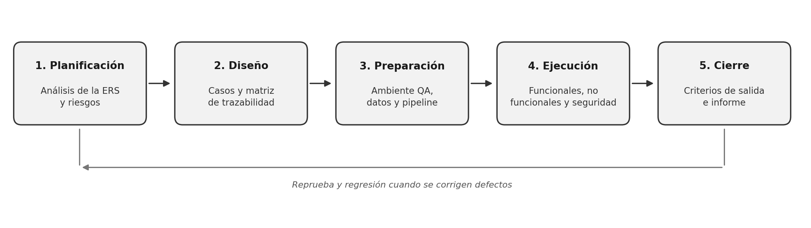

# 3. Plan de pruebas

## 3.1 Estrategia de pruebas

### Enfoque

Proponemos un enfoque mixto basado en riesgo. Las pruebas que se repiten en cada cambio (unitarias, API, control de acceso, regresión, carga y análisis de seguridad automático) se automatizan y corren en integración continua. Las que necesitan criterio de una persona, como usabilidad con adultos mayores, accesibilidad con lector de pantalla, pruebas exploratorias y pentest manual, se hacen a mano.

También aplicamos *shift-left*: el análisis de código y de dependencias corre desde el primer commit, y no se deja la seguridad para el final. Esto va en la línea de la seguridad por diseño que plantea la Ley 21.663.

### Etapas

Siguiendo ISO/IEC/IEEE 29119, el proceso tiene cinco etapas:

1. **Planificación:** análisis de la ERS, riesgos, alcance y este plan.
2. **Diseño:** casos de prueba, datos de prueba y matriz de trazabilidad.
3. **Preparación:** ambiente QA, datos ficticios, herramientas y pipeline.
4. **Ejecución:** unitarias → integración y API → sistema → no funcionales → seguridad → aceptación del cliente.
5. **Cierre:** revisión de criterios de salida e informe de resultados.

Figura 1. Etapas del proceso de pruebas y su realimentación.

### Priorización

La prioridad sale de cruzar probabilidad e impacto, dando más peso cuando hay datos personales o bancarios de por medio.

| Prioridad | Riesgo | Requerimientos |
|---|---|---|
| P1 | Una empresa ve datos de otra, o un editor logra modificar información | RB-2, RB-4, NFR-SEG-4 |
| P1 | Inyección SQL, XSS o CSRF | NFR-SEG-5 |
| P1 | Sesión que sigue válida después del logout o token manipulado | RF-1.2, NFR-SEG-9 |
| P2 | Estado de contrato mal calculado o CRUD con validaciones fallidas | RF-4, RF-5.4 |
| P2 | No se cumplen los tiempos de respuesta | NFR-PERF |
| P3 | Barreras de usabilidad o diferencias entre navegadores | NFR-USAB, NFR-COMPAT |

Tabla 4. Priorización de riesgos y requerimientos asociados.

### Criterios de entrada y salida

Para empezar a ejecutar necesitamos la ERS aprobada (con las dudas de la sección 2.4 resueltas o asumidas), el build desplegado en QA con TLS, las pruebas unitarias en verde, datos ficticios cargados y la autorización escrita para el pentest.

Damos por terminadas las pruebas cuando:

- el 100 % de los casos P1 está aprobado;
- no quedan defectos abiertos de severidad crítica o alta;
- OWASP ZAP y el pentest no reportan vulnerabilidades críticas ni altas;
- se cumplen los umbrales de NFR-PERF y el SUS es de 70 o más;
- el Product Owner aprueba el informe de resultados.

Si un defecto bloquea más del 30 % de los casos o aparece una vulnerabilidad que expone datos, se suspende la ejecución hasta corregirlo y se repite la regresión del módulo afectado.

## 3.2 Tipos de prueba

### Pruebas funcionales

Verifican que Atlas haga lo que dice la ERS. Incluyen pruebas **unitarias** para la lógica aislada (cálculo del estado del contrato, validación de RUT, política de contraseñas), pruebas de **sistema** que recorren flujos completos desde la interfaz (registro, creación de empresa, alta de cliente y contrato) y pruebas de **regresión** que se repiten en cada cambio. Las reglas de negocio RB-1 a RB-5 se prueban aquí.

### Pruebas de integración

Comprueban que frontend, API, base de datos y almacenamiento de documentos funcionen juntos. El ejemplo más claro es la carga de un documento: pasa por la API, se guarda en el storage interno, se referencia en PostgreSQL y genera un registro de auditoría (RF-5.2, RF-5.3, RF-6.1). Aquí también entra la colección Swagger/Postman de endpoints críticos que pide la sección 3.1.2 de la ERS.

### Pruebas de seguridad

Son las de mayor prioridad por el tipo de datos que maneja Atlas. Contemplan análisis estático del código y de dependencias, escaneo dinámico de la aplicación en QA, pruebas de control de acceso (intentar escribir con un editor o pedir recursos de otra empresa cambiando el ID), pruebas de sesión y tokens, revisión de TLS y cifrado en reposo, y un pentest manual con checklist ASVS antes de producción.

### Pruebas de rendimiento

Buscan demostrar los umbrales de NFR-PERF: menos de 300 ms en operaciones CRUD simples, carga de la página principal en menos de 2 s en red móvil y soporte para 200 usuarios concurrentes. Se hace una prueba de carga con la concurrencia esperada y una de estrés para ver dónde se degrada el sistema.

### Pruebas de usabilidad y accesibilidad

Se hacen sesiones con 5 adultos mayores, como pide la ERS, midiendo tareas completadas, errores y el puntaje SUS. En paralelo se revisa la conformidad con WCAG 2.1 AA: contraste, etiquetas ARIA, navegación con teclado y tamaño de los controles táctiles.

### Pruebas de aceptación

Cierran el ciclo. El Product Owner de CreaLab recorre los flujos principales (registro, alta de cliente, contrato con documento y consulta de auditoría) con datos ficticios y confirma que el sistema responde a lo que la empresa necesita. Se ejecutan en preproducción, después de las pruebas de seguridad.

### Pruebas de compatibilidad

Se ejecutan los flujos principales en las dos últimas versiones de Chrome, Firefox, Safari y Edge, y en celular, tablet y escritorio (NFR-COMPAT-1 y 2).

## 3.3 Criterios de aceptación

Además del criterio propio de cada caso, un caso solo se aprueba si cumple estas condiciones generales:

**Funcionales**
- La operación se completa y los datos quedan bien guardados.
- Las validaciones existen también en el backend: una petición directa a la API con datos inválidos responde 400 o 422.
- Las eliminaciones son lógicas y piden confirmación.

**No funcionales**
- CRUD simples con p95 bajo 300 ms y página principal bajo 2 s.
- Tasa de error menor a 1 % con 200 usuarios concurrentes.
- Sin incumplimientos críticos de WCAG 2.1 AA.

**Seguridad y reglas de negocio**
- Un recurso sin autorización responde 401 o 403 sin revelar si existe.
- Ningún mensaje muestra contraseñas, tokens, trazas o SQL.
- Solo usuarios de la empresa ven sus datos, y el editor no puede crear, editar ni eliminar.

Los defectos se clasifican en crítico, alto, medio o bajo. Los críticos y altos bloquean la liberación; los medios y bajos se aceptan con fecha de corrección.

Cada defecto se registra en Jira con los pasos para reproducirlo, la evidencia y el requerimiento afectado. El ciclo es: nuevo, asignado, en corrección, listo para verificar y cerrado; si la verificación falla, vuelve a abrirse. Los defectos de seguridad se manejan con visibilidad restringida al equipo, para no exponer detalles del sistema mientras no estén corregidos.

## 3.4 Herramientas utilizadas

| Herramienta | Para qué la usamos |
|---|---|
| Jest y Supertest | Pruebas unitarias y de endpoints en Express; es lo estándar en Node.js |
| React Testing Library | Pruebas de componentes como formularios de login y clientes |
| Swagger + Postman/Newman | Colección de endpoints críticos que pide la ERS, ejecutable en el pipeline |
| Playwright | Flujos end-to-end en Chromium, Firefox y WebKit (Safari), con emulación móvil |
| BrowserStack | Pruebas en dispositivos reales (iPhone, iPad, Android) |
| k6 | Pruebas de carga y estrés con umbrales configurables |
| Lighthouse | Tiempo de carga en móvil y auditoría básica de accesibilidad |
| axe DevTools y NVDA | Revisión WCAG automática y navegación con lector de pantalla |
| OWASP ZAP y Burp Suite | Escaneo dinámico y pruebas manuales de tokens, IDOR y CSRF |
| SonarQube / Semgrep y npm audit | Análisis estático del código y vulnerabilidades en dependencias |
| GitHub Actions | Ejecución automática de las pruebas en cada push |
| Jira | Registro y seguimiento de defectos |

Tabla 5. Herramientas seleccionadas y su uso en el proyecto.

## 3.5 Recursos y cronograma

### Recursos humanos

Un QA Lead que coordina y aprueba los criterios de salida; dos analistas QA que diseñan y ejecutan los casos; un ingeniero de automatización a cargo de los scripts; un analista de seguridad para el análisis y el pentest; un especialista UX para las pruebas con usuarios; los desarrolladores para corregir defectos, y el Product Owner de CreaLab para resolver dudas y aprobar. Para usabilidad se necesitan además 5 adultos mayores que participen de las sesiones.

### Recursos técnicos y entornos

Node.js 20 LTS, las versiones del stack indicadas en la ERS y PostgreSQL. Navegadores Chrome, Firefox, Safari y Edge; notebooks con Windows y macOS, celulares Android e iPhone y tablets.

Trabajamos con cuatro ambientes: desarrollo para pruebas unitarias, integración continua para la regresión automática, QA como réplica de producción para el resto de las pruebas, y preproducción para la aceptación y la carga final. En ningún ambiente se usan datos reales de clientes, solo datos ficticios.

### Cronograma

| Semana | Actividades | Hito |
|---|---|---|
| 1 | Análisis de la ERS, riesgos y aprobación del plan | Plan aprobado |
| 2 | Casos, datos de prueba, ambiente QA y pipeline | Ambiente listo |
| 3 | Pruebas funcionales, de integración y de API | Casos P1 funcionales aprobados |
| 4 | Rendimiento, compatibilidad y sesiones de usabilidad | Informe de carga y SUS |
| 5 | Pruebas de seguridad y pentest | Sin hallazgos críticos |
| 6 | Reprueba, regresión, aceptación del cliente e informe | Aceptación formal |

Tabla 6. Cronograma referencial de seis semanas.
